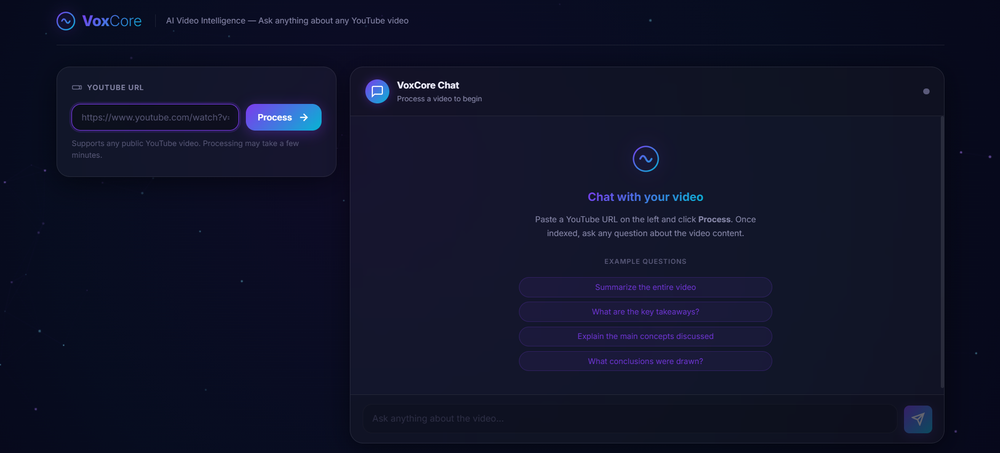

# 🎙️VoxCore: AI-Powered Video Intelligence Platform

> **End-to-end pipeline that transcribes audio, builds a RAG index, and generates intelligent summaries and interactive chats using Llama.**



## 🛠️ Tech Stack 


---

## 🏗️ Architecture

```text
Audio File
   │
   ▼
Web UI (Flask)        (app.py)
   │  – File upload, real-time status
   ▼
Audio Pre-processing  (src/audio.py)
   │  – resample → 16 kHz mono WAV
   ▼
Faster-Whisper        (src/transcriber.py)
   │  – word-level timestamps, language detection
   ▼
Transcript Loader     (src/loader.py)
   │  – loads .txt / .json transcript
   ▼
Sentence Chunker      (src/chunker.py)
   │  – SentenceSplitter, configurable chunk/overlap size
   ▼
BGE Embedder          (src/embedder.py)
   │  – BAAI/bge-small-en-v1.5 (local)
   ▼
Vector Store          (src/vector_store.py)
   │  – LlamaIndex + FAISS index, persisted to data/index/
   ▼
Retrieval & Chat      (src/engine.py)
   │  – RAG-based Chatbot & Summarizer
   ▼
Llama LLM             (src/llm.py)
   │  – OpenAI-compatible Llama API
   ▼
Output                (outputs/summaries/)
```
